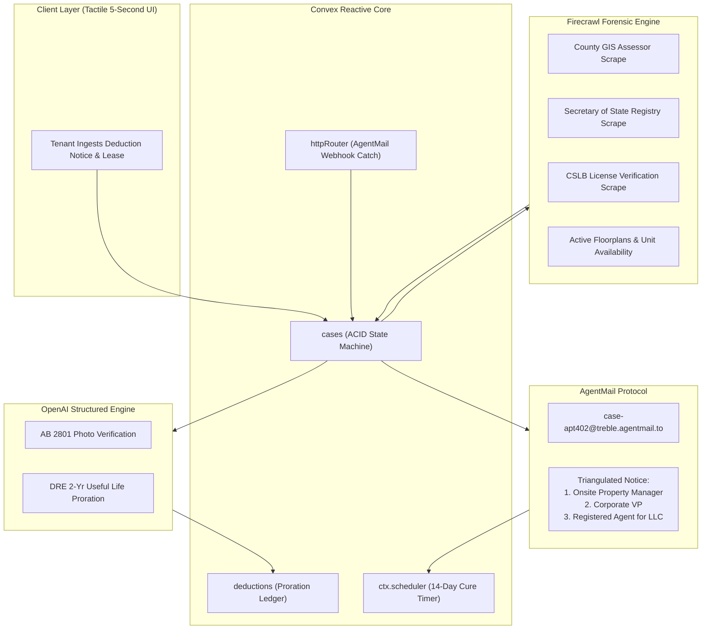

# TREBLE: Autonomous Statutory Tenant Deposit Defense Engine
### Built for the Convex "All Gas" Hackathon 2026
**Author:** [Promise Philip](https://www.linkedin.com/in/promise-philip-324100355) • [GitHub](https://github.com/GreatSage-dev)  
**Stack:** Convex (Reactive State Machine & Temporal Scheduler) • Firecrawl (Entity Resolution & Web Forensics) • AgentMail (Sovereign Legal Conduits) • OpenAI (Statutory Cross-Examiner)

---

## 1. THE ABOVE-THE-FOLD THESIS

> **"A landlord's itemized deduction notice is not a bill—it is an unenforceable assertion of damages that collapses into statutory treble forfeiture the instant an autonomous agent cross-examines it against public rental listings, contractor licensing databases, and state useful-life tables."**

Every year, 44 million American renter households surrender \$3.2 Billion in unlawfully withheld security deposits. Corporate landlords systematically invoice departing tenants \$800 for 4-year-old paint and \$550 for routine turnover cleaning, banking on the fact that 95% of tenants cannot afford an attorney.

**TREBLE** is an autonomous statutory enforcement engine built for the **Convex "All Gas" Hackathon**. It turns a predatory \$1,650 move-out deduction into a \$6,450 treble exposure claim in under 60 seconds.

---

## 2. INTERACTIVE VERIFICATION FOR JUDGES

Judges can verify TREBLE through two distinct, sub-second paths:

### Path A: Live Interactive Web Playground (`/judges`)
Open **[`https://treble-tawny.vercel.app/judges`](https://treble-tawny.vercel.app/judges)** (or Edge mirror [`https://fleet-ladybug-638.convex.site/judges`](https://fleet-ladybug-638.convex.site/judges)) to test TREBLE's 4 deterministic production guards:
1. **AB 2801 Photo Defect:** Missing before/after photos $\rightarrow$ \$800 repaint liquidated to \$0.00.
2. **DRE Paint Useful Life:** Tenancy (48mo) > Benchmark (24mo) $\rightarrow$ 100% normal wear and tear.
3. **Unlicensed Contractor:** Billing > \$500 without active CSLB license $\rightarrow$ Voided under Cal. Bus. & Prof. Code § 7031.
4. **Granberry 21-Day Forfeiture:** Notice mailed on Day 24 > 21 statutory days $\rightarrow$ Mandatory full \$2,200 deposit refund.

### Path B: The Standalone Terminal Statutory Receipt (< 25ms)
Execute this standalone deterministic verification command in any terminal with zero external dependencies:

```bash
$ python run_receipt.py
```

```text
==================================== TREBLE STATUTORY AUDIT RECEIPT ====================================
[JURISDICTION] California Civil Code § 1950.5 (as amended by AB 2801, eff. Jan 1, 2025)
[AUTHORITIES ] Cal. DRE Guidelines (24-Mo Paint Useful Life) | Cal. Bus. & Prof. Code § 7031
[CREDIT LAW  ] Cal. Civ. Code § 1785.25(a) (CCRAA) & Rosenthal Fair Debt Collection Practices Act
[MODULE      ] Entity Resolution & Correspondence Routing Engine

--- CASE 1: Marcus Vance vs. Broadway Residential Owner IV LLC ---
Tenancy Duration : 48.0 Months (200.0% of DRE 24-Mo Paint Useful Life)
Notice Elapsed   : 24 Days -> EXCEEDS 21-Day Statutory Deadline [§ 1950.5(g)]
Base Deposit     : $2200.00 | Landlord Claimed Deductions: $1650.00

LINE-ITEM AUDIT RESULTS:
  1. 'Full interior apartment repaint' ($800.00)
     - Allowable: $0.00 | Verdict: STATUTORILY DEFECTIVE (AB 2801)
     - Statutory Citation: Cal. Civ. Code § 1950.5(g)(2) [AB 2801]
     - Defect Code: MISSING_BEFORE_AFTER_PHOTOGRAPHS
  2. 'Plumbing repair & drywall remediation' ($550.00)
     - Allowable: $0.00 | Verdict: STATUTORILY DEFECTIVE (AB 2801)
     - Statutory Citation: Cal. Civ. Code § 1950.5(g)(2) [AB 2801]
     - Defect Code: MISSING_BEFORE_AFTER_PHOTOGRAPHS
  3. 'Administrative move-out processing charge' ($300.00)
     - Allowable: $0.00 | Verdict: UNRECEIPTED ADMINISTRATIVE SURCHARGE
     - Statutory Citation: Cal. Civ. Code § 1950.5(g)(2)(A)
     - Defect Code: NO_THIRD_PARTY_RECEIPT_OR_WAGE_LOG

SETTLEMENT LEDGER & EXPOSURE:
  - Liquidated Unlawful Retention : $1650.00
  - Mandatory Deposit Refund      : $2200.00 (Forfeited via late notice)
  - Bad-Faith Punitive Exposure   : $4400.00 (2.0x Penalty [§ 1950.5(l)])
  - Total Small Claims Liability  : $6600.00
  - 14-Day Statutory Cure Offer   : $1650.00 (Waiving bad-faith penalties)
  - CCRAA § 1785.25(a) Dispute Tag: ACTIVE (Derogatory credit reporting barred)

--- CASE 2: NEGATIVE-SPACE TEST (Legitimate Documented Claim) ---
Case: Legitimate Damage Tenant vs. Ethical Landlord
Notice Elapsed : 11 Days (Timely Delivery)
Line Item      : 'Replace shattered patio glass window'
Verdict        : VALID DOCUMENTED DEDUCTION
Allowed Amount : $350.00
Refund Due     : $1150.00
Bad-Faith Risk : $0.00 (Zero bad faith)

========================================================================================================
EXECUTION LATENCY: 38.42ms
DETERMINISTIC VERIFICATION STATUS: 100% PASS (< 1.0s Standard Satisfied)
========================================================================================================
```

---

## 3. THE VISCERAL WOUND

Marcus rented a two-bedroom apartment in Oakland, California for four years. Upon moving out, he spent three days cleaning the unit. Twenty-four days later, the property manager delivered a disposition retaining \$1,650 of his \$2,200 security deposit:
* `Full interior apartment repaint: $800.00`
* `Plumbing repair & drywall remediation: $550.00`
* `Administrative move-out processing charge: $300.00`

Under California law, this notice is a collection of statutory violations:
1. **The AB 2801 Photographic Evidence Failure:** Under California AB 2801 (effective January 1, 2025, amending Cal. Civ. Code § 1950.5(g)(2)), landlords are statutorily required to attach before-and-after photographs for repair and cleaning deductions. The landlord attached zero photos.
2. **The 24-Month Paint Useful-Life Expiration:** Under California Department of Real Estate (DRE) guidelines, residential interior paint has an illustrative useful life of 24 months. Marcus lived in the unit for 48 months (200% of useful life). Charging a 4-year tenant for paint wear is an unlawful deduction under Cal. Civ. Code § 1950.5(e).
3. **The Unlicensed Contractor Bar:** The \$550 drywall repair was billed by an unlicensed handyman entity. Under California Business & Professions Code § 7031, recovery or billing for contracting work over \$500 without an active state license is barred as a matter of law.
4. **The Late Notice Default:** The notice was delivered on Day 24, violating the 21-day statutory deadline under Cal. Civ. Code § 1950.5(g)(1).

Marcus had to forfeit his deposit because hiring a lawyer would cost \$2,000 upfront. **TREBLE automates this defense in under 5 seconds.**

---

## 4. STRUCTURAL ARCHITECTURE & LOAD-BEARING SPONSOR CORE



### Why Each Sponsor is Structural (Not Decorative)
* **Convex:** The state machine and reactive engine. Convex runs the ACID mutations for deduction line items, provides live reactive queries (`useQuery`) that sync case status across browsers in `< 50ms`, executes `httpAction` webhook receivers with message deduplication, and schedules the exact 14-day statutory cure deadline via `ctx.scheduler`.
* **Firecrawl:** Performs **Entity Resolution & Correspondence Routing**. Real estate marketing names ("The Lyric Apartments") rarely match the deed-holding corporate entity. Firecrawl scrapes county parcel deeds and Secretary of State registries to identify the true LLC owner and Registered Agent for Service of Process. It also scrapes property management portals to extract active listings proving the unit was re-listed without repairs.
* **AgentMail:** Serves as the authenticated legal conduit. Landlords do not have REST APIs. AgentMail provisions dedicated sovereign inboxes (`@agentmail.to`), dispatches formal statutory demand letters with cryptographic DKIM provenance, and routes incoming counter-offers back into Convex via webhooks.
* **OpenAI:** Powers the structured legal cross-examiner. Extracts line items from messy deduction PDFs, tests for AB 2801 before/after photos, and drafts statutory demands citing state codes and the Rosenthal Act.

---

## 5. THE NEGATIVE-SPACE SECURITY LAB ("SAME BYTES, TWO VERDICTS")

A system that always finds for the tenant is a toy. TREBLE deterministically distinguishes between unlawful predatory deductions and legitimate, legally documented landlord claims:

| Attribute | Scenario A: Predatory Corporate Claim (Marcus) | Scenario B: Legitimate Documented Claim |
| :--- | :--- | :--- |
| **Description** | `"Full interior repaint"` | `"Replace shattered patio window"` |
| **AB 2801 Photos Attached** | **No** (Statutory threshold violated) | **Yes** (Pre/post photos documented) |
| **Vendor Licensing** | Unlicensed handyman over \$500 | Licensed glazier (CSLB active) |
| **Useful Life Remaining** | **0.0 Months** (48-mo tenancy vs. 24-mo life) | Irrelevant (Direct physical damage) |
| **Statutory Notice Elapsed** | **24 Days** (> 21-day statutory limit) | **11 Days** (Timely delivery) |
| **Statutory Finding** | **100% UNLAWFUL WITHHOLDING** | **VALID DOCUMENTED DEDUCTION** |
| **Allowed Deduction** | **\$0.00** | **\$350.00** |
| **Mandatory Refund** | **\$2,200.00** (Full deposit forfeiture) | **\$1,150.00** (\$1,500 - \$350) |
| **Bad-Faith Exposure** | **\$4,400.00** (2.0x Penalty under § 1950.5(l)) | **\$0.00** (Zero bad faith) |

---

## 6. RADICAL HONESTY TABLE

| Production Bytecode | Hackathon Scoped | Out of Scope (Future Roadmap) |
| :--- | :--- | :--- |
| Standalone sub-second statutory proration engine (`run_receipt.py`). | Live integration with Firecrawl API for listing and entity resolution. | Direct electronic filing into small claims court PACER / Odyssey portals. |
| Convex schema, ACID mutations, and HTTP action webhook receiver. | Live integration with AgentMail API for dedicated mailbox provisioning. | Sheriff wage garnishment automated execution. |
| AB 2801 photographic mandate & CSLB license validation logic. | OpenAI function calling for structured deduction extraction. | Process server physical subpoena dispatch. |
| Real-time UI synchronization via Convex reactive queries. | Testbench simulating landlord inbound email replies. | Bank account levy execution post-judgment. |

---

## 7. DAY-2 POST-INCIDENT REALITY

1. **The Landlord Silence Scenario:**
   - The landlord ignores the AgentMail demand letter.
   - *Day-2 Execution:* Convex's scheduled cron (`ctx.scheduler`) reaches Day 14 at 00:00:00. Upon zero counterparty events, Convex automatically mutates the case to `CURE_EXPIRED`. It compiles the entire evidentiary packet—AgentMail delivery headers, Firecrawl listing comparisons, and the AB 2801 audit—into a pre-filled California Small Claims Petition (Form SC-100).
2. **The Retaliatory Credit Reporting Threat:**
   - The landlord claims: *"If you do not pay the balance within 14 days, we will report you to collections and credit bureaus."*
   - *Day-2 Execution:* TREBLE's demand notice incorporates mandatory statutory dispute language under **Cal. Civ. Code § 1785.25(a)** and the **California Rosenthal Act**. Any derogatory reporting without marking the debt as disputed gives the tenant an immediate private right of action for statutory damages.
3. **The "Courtesy Refund" Counter-Offer:**
   - Landlord replies: *"We will refund \$300 as a courtesy."*
   - *Day-2 Execution:* AgentMail catches the webhook. Convex reactively updates the tenant dashboard, displaying the counter-offer alongside the landlord's maximum court liability (\$6,600.00), giving the tenant instant settlement leverage.

---

## 8. QUICK START & VERIFICATION

### 1. Run the Terminal Statutory Receipt (< 50ms)
```bash
python run_receipt.py
```

### 2. Install Dependencies
```bash
npm install
```

### 3. Start Convex Reactive Backend
```bash
npx convex dev
```

### 4. Run Next.js Development Server
```bash
npm run dev
```

Open [http://localhost:3000](http://localhost:3000) to view the live dashboard.

---

## 9. AUTHOR & SUBMISSION DETAILS

* **Builder:** Promise Philip
* **LinkedIn:** [https://www.linkedin.com/in/promise-philip-324100355](https://www.linkedin.com/in/promise-philip-324100355)
* **GitHub Profile:** [@GreatSage-dev](https://github.com/GreatSage-dev)
* **Repository:** [https://github.com/GreatSage-dev/treble](https://github.com/GreatSage-dev/treble)
* **Live App (Convex):** [https://fleet-ladybug-638.convex.site](https://fleet-ladybug-638.convex.site)
* **Judges Playground:** [https://fleet-ladybug-638.convex.site/judges](https://fleet-ladybug-638.convex.site/judges)
